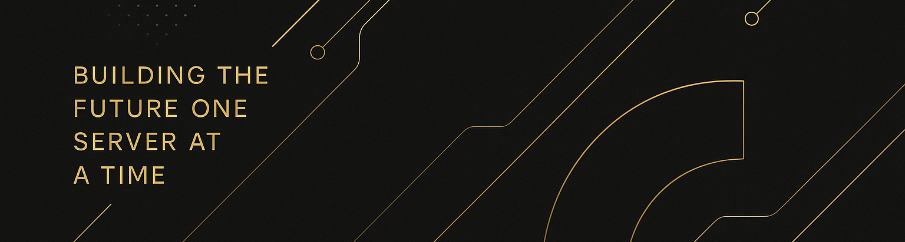

<!-- Banner -->

  

<!-- Name & Motto -->
<h3 align="center">
  <b>YΛZΛП 
  
</h3>

<h2>👋 About Me</h2>

<b><h3>Outside of code and tech, I’m into:</h3>
• 🕹️ Gaming & tech games ‧ 🎯 Airsoft & sports
• 🏡 Homelab tinkering ‧ 🎨 Graphic design
• 🚀 Innovations, tech & space news
• 🍿 Movies, music, podcasts, reading
• 🌍 Traveling ‧ 👫 Friends & new experiences</h4>

<h2>🌐 Languages I Speak</h2>

   
  
  

<h2>🛠️ Tech Stack</h2>

<h3>Programming Languages</h3>

<h3>Frameworks & Tools</h3>

<h3>DevOps & Infra</h3>

<h3>Networks</h3>

  
  
  
  
  
  
  

<h3>Webdev</h3>

<h3>Design & Multimedia</h3>

<h3>Microsoft Fan Apps</h3>  

<h2>🎧 Now Playing</h2>

<h2>📊 My GitHub Stats & Achievements</h2>

  
  
  

<h2>📫 Contact</h2>

  
  
  

